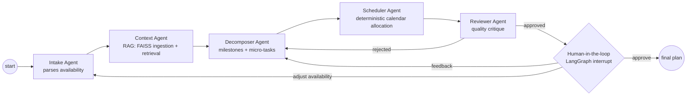

# AI Learning Planner — Multi-Agent Orchestrator

A multi-agent AI system built with **Gemini**, **LangGraph** and **LangChain** that generates and
iteratively refines personalized study roadmaps. It ingests resumes and unstructured learning
material into a **FAISS** vector store (RAG) so plans are grounded in what the learner already
knows, and it keeps a **human in the loop** at every revision via LangGraph interrupts.

Comes with two frontends:

- a colorful **CLI** (`main.py`)
- an **Angular 22 + Tailwind CSS dashboard** with a live visualization of which sub-agent is
  currently handling the task (`dashboard/` + `server.py`)

## Architecture



| Agent | Responsibility |
| --- | --- |
| **Intake** | Parses natural-language availability ("2.5 hrs on weekdays") into a validated `TimeAllocation` via Gemini structured output |
| **Context (RAG)** | Document ingestion pipeline: loads `.pdf`/`.txt` from `source_for_context/`, chunks them, embeds with Gemini embeddings into **FAISS**, retrieves the chunks relevant to the goal and summarises the learner profile |
| **Decomposer** | Decomposes the goal into 2–6 **milestones** and sequential **micro-tasks** (structured output validated by Pydantic guardrails, with automatic retry on violation) |
| **Scheduler** | Deterministic (non-LLM) allocation of tasks onto a day-wise calendar, splitting tasks that exceed daily capacity |
| **Reviewer** | LLM critique of the draft plan; can send it back to the decomposer for one automatic revision |
| **Human** | LangGraph `interrupt()` — approve, request changes (feedback refinement loop) or adjust availability |

Every agent emits custom LangGraph stream events, which power both the CLI status lines and the
dashboard's live agent visualization.

## Setup

```bash
python -m venv .venv
.venv\Scripts\activate            # Windows (use source .venv/bin/activate on Unix)
pip install -r requirements.txt
echo GEMINI_API_KEY=your_key_here > .env
```

Drop your resume / skills documents (`.pdf` / `.txt`) into `source_for_context/`.

### Run the CLI

```bash
python main.py
```

### Run the dashboard

```bash
# terminal 1 — orchestrator API (FastAPI + SSE)
python server.py

# terminal 2 — Angular dev server
cd dashboard
npm install
npm start
```

Open http://localhost:4200. The dashboard shows the LangGraph pipeline in real time: the active
agent pulses while "thinking", connectors animate as work flows between agents, and the
human-in-the-loop panel appears whenever the graph pauses on an interrupt.

> **Simulation mode:** if the server has no `GEMINI_API_KEY` (or `SIMULATE=1` is set), it emits a
> scripted run over the same event protocol so the dashboard can be demoed without an API key.

## Project layout

```
agents/            LangGraph multi-agent orchestration
  graph.py         graph topology + conditional routing
  nodes.py         the six agent node implementations
  state.py         shared PlannerState
rag.py             FAISS ingestion + retrieval pipeline
schemas.py         Pydantic structured-output contracts & guardrails
planner.py         deterministic scheduler + markdown formatting
main.py            CLI frontend
server.py          FastAPI backend for the dashboard (SSE event stream)
dashboard/         Angular 22 + Tailwind CSS glassmorphism dashboard
```

## Tech stack

Python · Gemini (`gemini-2.5-flash` + `gemini-embedding-001`) · LangGraph · LangChain · FAISS ·
Pydantic · FastAPI · SSE · Angular 22 (zoneless, signals) · Tailwind CSS 4
